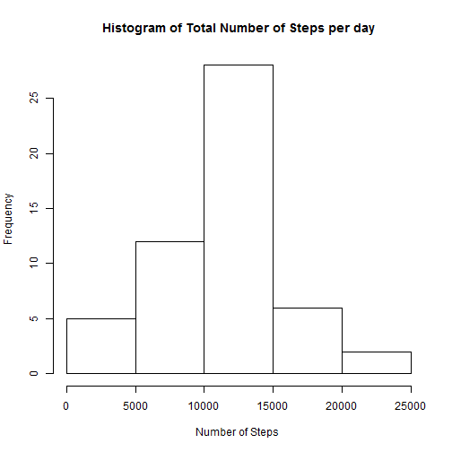
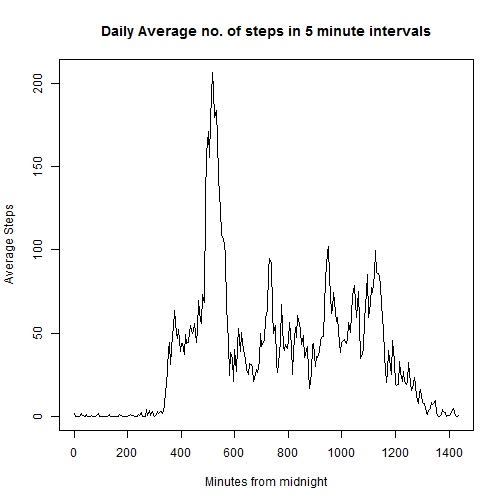
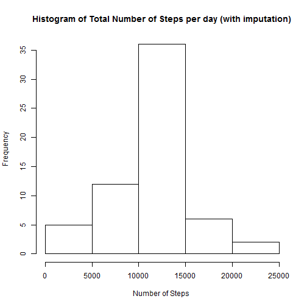
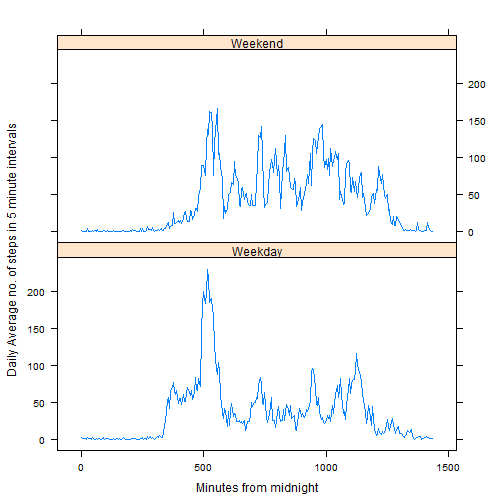

## Loading and preprocessing the data
The code below is to :  
1) Check if the zip file containing data file exists.  
2) If the zip file exists, unzip.  
3) Read in the data file into a dataframe.  
4) Initial Process/Transformation of data including converting date field to 
correct format and calculating the interval field to minutes since midnight.  
      


```r
rm(list=ls())
#opts_chunk$set(echo=TRUE, results="hide")   #Set defaults for code chunks
options(scipen = 1)
par(mfrow=c(1,1)) #set plot parameter
if(!file.exists("activity.zip")){stop("Activity file not found")}


unzip("activity.zip", files = NULL, list = FALSE, 
            overwrite = TRUE,
            junkpaths = TRUE, exdir = ".", unzip = "internal",
            setTimes = FALSE)

df <- read.table(file = "activity.csv", header=TRUE,sep=",",
                 stringsAsFactors= FALSE)

df$date <- as.Date(df$date)  #Format character is the first default %Y-%m-%d.

df$interval <- as.integer(60*((df$interval)%/%100) +  #convert interval
                                (df$interval)%%100)   #to minutes from 00:00
 
suppressPackageStartupMessages(library(dplyr)) #Load dplyr package 
```


## What is mean total number of steps taken per day?

To determine this information, the code below does the following: 
1) Identify  observations that do not have null values for steps.  
2) Create a copy of the dataset without the null value onservations.  
3) Using the dplyr package data manipulation pipeline, group the day and 
summarise to calculate the daily total for steps taken. This basically adds up 
all the steps walked in the different  intervals for each day.  
4) The sumamrised dataset has the date and the total number of steps taken that 
day.   
5) Plot a histogram showing the distribution of total number of steps taken each
day.   
6) Finally, we calculate the mean and median for the daily total steps. 

(For Mean and Median Daily Steps, see lines  immediately below the plot) 


```r
#find rows tht are complete (i.e have no NAs)
cc <- complete.cases(df)

# create a copy of the data frame ...but just without the rows with NAs
df1 <- df[cc,]  

steps_by_days <- df1 %>%    #start dplyr piping of df1 dataframe
      group_by(date) %>%    #group date
      summarise(daily_steps=sum(steps,na.rm=TRUE)) # Redundant na.rm clause


# Plot histogram of daily steps 
hist(steps_by_days$daily_steps, 
     xlab= "Number of Steps ",
     main= "Histogram of Total Number of Steps per day")
```

 


Mean of daily steps is  10766.1886792.   
Median of daily steps is  10765.


## What is the average daily activity pattern?
For this analysis we use R code below to do the following:  

1) Calculate the average number of steps walked during the same 
time-slot/interval for all days.  
2) Determine the highest average number of steps among the differnt days using 
the max function.  
3) Determine the interval where the max happens.   


```r
steps_by_intervals <- df1 %>%    #start dplyr piping of df1 dataframe
      group_by(interval) %>%    #group by interval
      summarise(avg_steps=mean(steps,na.rm=TRUE)) # 

#capture info on when maximum no. of steps are taken during the day

t_max <- steps_by_intervals[steps_by_intervals$avg_steps==
                                  max(steps_by_intervals$avg_steps),1]

max_steps <- steps_by_intervals[steps_by_intervals$avg_steps
                                ==max(steps_by_intervals$avg_steps),2]

interval_max <- t_max%%60 + 100*(t_max%/%60) #reverse calc the interval 

with(steps_by_intervals, plot(interval, avg_steps, 
              type ="l",            # line graph 
              ylab="Average Steps", # set y label
              xlab="Minutes from midnight",
              main="Daily Average no. of steps in 5 minute intervals"))   
```

 

The maximum of average daily steps taken was 206.1698113 at interval 
835.

## Imputing missing values

For this analysis, we:  
1) Calcualte number of missing records in original dataset(df).  
2) For each record in the data with missing steps, replace the value (NA) 
with the average steps for that particular interval from the rest of the days.  
3) Recalculate the daily total steps using the updated dataset.  
4) Plot histogram as before.


```r
options(scipen = 1)
#calculate number of observations  with NAs in the original dataset 
missing_vals<- sum(is.na(df)) #using the original dataframe with the NAs


#percent_missing <- 100*missing_vals/dim(df) ## calc % of data is missing

# For observations that have null values for step variable...replace with mean
# There is probably a better way to do this using apply/transform...


for (obs in which(is.na(df$steps))) {
#      df$steps[obs] <- steps_by_intervals[(df[  ,3]),2]

      df$steps[obs] <- steps_by_intervals[which(steps_by_intervals$interval==
                                    df$interval[obs]),]$avg_steps      
}


#head(df) ##for debugging
#tail(df) ##for debugging


#Historgram using updated dataset

steps_by_days_new <- df %>%    #start dplyr piping of df1 dataframe
      group_by(date) %>%    #group by date
      summarise(daily_steps=sum(steps)) # 


# Plot histogram of daily steps 
hist(steps_by_days_new$daily_steps, 
     xlab= "Number of Steps ",
     main= "Histogram of Total Number of Steps per day (with imputation)")
```

 


Number of missing values in original dataset is 2304.


Since there seems to be a daily pattern in number of steps, our strategy is to 
replace the missing number (of steps) using the mean number for that particular
interval. 


After imputation:  
Mean of daily steps is  10766.1886792.   
Median of daily steps is  10766.1886792.

Prior to imputation:  
Mean of daily steps is  10766.1886792.   
Median of daily steps is  10765.

Initial conclusion based on this:  
The new mean (i.e. mean after imputation) is exactly the same value as the
mean prior to imputation. The new median after the imputation has changed and 
tilted closer to the opiginal mean. Further investigation required to confirm 
if using a different imputation strategy (say using median steps for missing 
intervals) would have affected differently.


## Are there differences in activity patterns between weekdays and weekends?

For this analysis, we create a new variable (wd_or_we) and populate the variable 
using the date information from the data. We then perform a summarization and 
plotting similar to earlier time series plot with the exceptiont that we now 
have two sets of time-series data showing average steps during the day: one each
for weekeday and weekend.


```r
#add a variable called wd_or_we to denote if the day is a weekday or weekend
df$wd_or_we <- ifelse(weekdays(df$date) %in% c("Sunday", "Saturday" ) , 
                      "Weekend", "Weekday"    )

steps_by_intervals_new <- df %>%    #start dplyr piping of df dataframe
      group_by(wd_or_we,interval) %>%        #group by weekday flag, interval
      summarise(avg_steps=mean(steps,na.rm=TRUE)) #no NAs anyway 


#with(steps_by_intervals_new, plot(interval, avg_steps, 
#              type ="l",            # line graph 
#              ylab="Average Steps", # set y label
#              xlab="Minutes from midnight",
#              main="Daily Average no. of steps in 5 minute intervals"))


#
#par(mfrow=c(2,1))

#with(subset(steps_by_intervals_new, wd_or_we == "Weekday"),
#      plot(interval, avg_steps, type="l", main="Weekday",
#            ylab="Average Steps", 
#            xlab="Minutes from midnight"
#                 ))

#with(subset(steps_by_intervals_new, wd_or_we == "Weekend"),
#     plot(interval, avg_steps, type="l", main="Weekend"))


#sample graph looks like it was generated from latticeplot

library(lattice)
xyplot(steps_by_intervals_new$avg_steps ~ steps_by_intervals_new$interval
       | steps_by_intervals_new$wd_or_we,
       layout=c(1,2), 
       type="l",
       xlab="Minutes from midnight",
       ylab="Daily Average no. of steps in 5 minute intervals")
```

 

These plots are not identical- whether the differences are significant will 
require more analysis. 

Some initial observations based on the Weekday Vs Weekend plot:  
1) The weekday peak around 830 am seems to be higher than the peak for weekend. 
Presumably, due to commute related. However work related commute may not explain
the initial peak at 835 am. entirely- as there is not a similar peak for return.  

2) Prior to the peak around 830 am on weekday, there seems to be gradual rampup.
Presumably this is for preparation for leaving for work.  

3) There are other several smaller peaks of activity during day-time on weekends 
that are higher than the weekday peaks during  day-time. An explanation could be 
that there is more activity spreadout during weekend days. 

